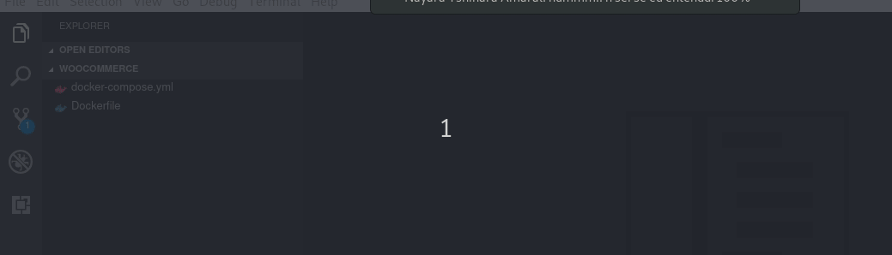

# Ecommerce Platform Debugging

This is a set of docker-compose and Dockerfiles of platforms integrated with PHP Xdebug.

# How to use it

### Requirements
- `Visual Studio Code`
- `PHP Debug` extension for Visual Studio Code
- `Xdebug Helper` Google Chrome extension

---

#### 1. Copy the platform code to the hosting machine

First we need to have access to the code on Docker through VSCode, so you need to copy the platform folder to the hosting machine, like:  `docker cp my_docker_container:/var/www/html .`

This way, we'll have the following folder structure:

```
-Platform
--html
```

#### 2. Configure PHP Debug extension

On Visual Studio Code, open the `Platform` folder, access Debug mode and click on PHP configuration:



Now access `launch.json` and add the following code to the object named `Listen for XDebug`:

```
"pathMappings": {
  "/var/www/html": "${workspaceRoot}/html"
}
```

With all this setup, add a breakpoint on some code through VSCode and enable the `Xdebug Helper` extension on Google Chrome. When you access the page affected by your breakpoint, the PHP code will stop execution and alert your VSCode. That's it!

Happy hunting
